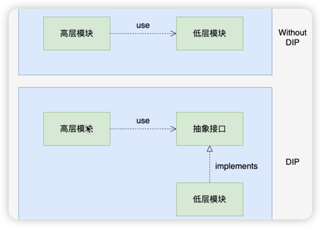
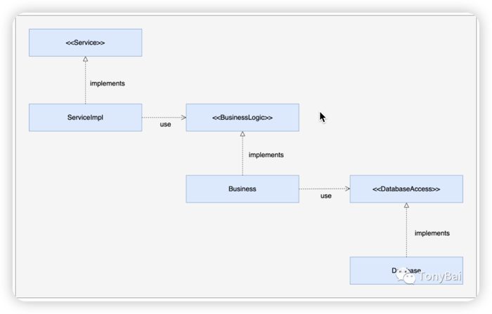
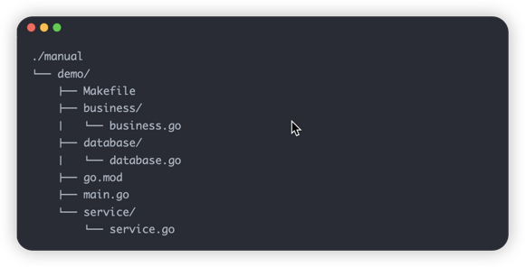

依赖倒置原则是面向对象设计中的基本原则之一，它阐述了高层模块和低层模块的依赖关系应该倒置(如下图)，也就是:

- 高层模块不应该依赖低层模块，二者都应该依赖其抽象
- 抽象不应该依赖细节，细节应该依赖抽象

依赖倒置原则实际上就是对控制反转(Inversion of Control，IoC)这一概念的阐述，而**依赖注入**是实现控制反转的一种机制。所以可以说，依赖倒置原则是设计级的指导思想，它提出了正确的依赖关系；而依赖注入是实现级的具体设计模式，它将组件的依赖关系控制权移到了外部，实现了组件之间的解耦，是对依赖倒置原则的一种实现手段。

依赖注入可以帮助你开发出松耦合的代码，**松耦合使代码更易于维护**。

### 手动注入
我们先建立一个符合DIP原则的例子，其依赖关系如下图：

这里有三个“模块”，从高到低分别为Service、BussinessLogic和DatabaseAccess。Service是一个接口，其实现ServiceImpl依赖BussinessLogic接口。Business是BussinessLogic的实现，它还依赖DatabaseAccess接口。Database则是DatabaseAccess接口的实现。

下面是示例的项目结构布局：

